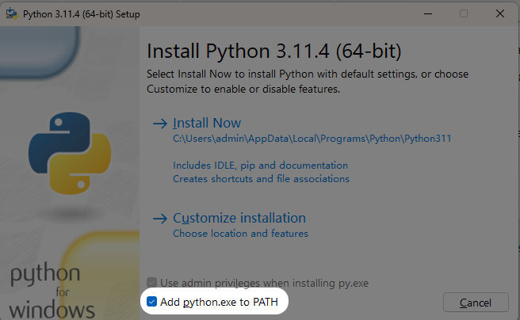
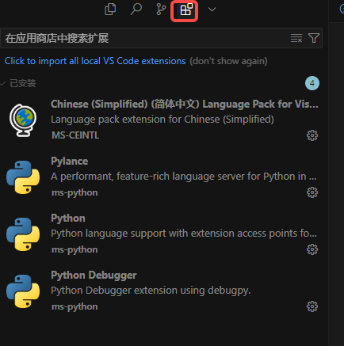
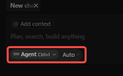

# 通过命令行安装开发环境

我们统一使用Python 3.11 + Poetry + Cursor(>0.47)版本作为上课的开发环境

## 1. 开发环境
### 1.1 安装Python
#### Windows系统

1. 访问Python官网的[3.11的Windows安装包](https://www.python.org/downloads/release/python-3114/)。绝大部分人应该都使用64bit安装包
2. 下载完成后运行安装程序，**在安装界面勾选"Add Python 3.11 to PATH"**



5. 点击"Install Now"开始安装
6. 安装完成后，打开powershell，输入以下命令验证安装:
```bash
python --version
```
你应该看到`Python 3.11.4`

#### MacOS系统

1. 推荐使用Homebrew包管理器安装：

   ```bash
   # 安装Homebrew（如果尚未安装）
   /bin/bash -c "$(curl -fsSL https://raw.githubusercontent.com/Homebrew/install/HEAD/install.sh)"
   
   # 使用Homebrew安装Python 3
   brew install python@3.11
   ```

3. 安装完成后，验证安装：
   ```bash
   python3 --version
   ```

4. 打开terminal，设置别名使`python`默认指向Python 3：
   ```bash
   # 根据你使用的shell，选择对应的配置文件
   # 如果使用bash
   echo 'alias python=python3' >> ~/.bashrc
   source ~/.bashrc
   
   # 如果使用zsh
   echo 'alias python=python3' >> ~/.zshrc 
   source ~/.zshrc
   ```

### 1.2 安装pip
如果你是按照上面的方法安装，你应该已经安装了pip。可以在命令行验证安装：
```bash
pip --version
```

### 1.3 Poetry
我推荐大家使用Poetry来管理Python的虚拟环境。

#### Windows系统安装Poetry
1. 使用pip安装
先检查
```powershell
pip -v
```
如果输出结果最后是python3.11，那么可以直接使用pip安装
```powershell
pip install poetry
```

验证安装
```powershell
poetry --version
```
你应该看到诸如`Poetry (version 2.1.2)`这样的结果

如果你没法安装poetry也不要紧张，你可以下载annaconda并使用conda来维持虚拟环境

#### MacOS系统安装Poetry
1. 打开终端，运行以下命令：
```bash
curl -sSL https://install.python-poetry.org | python3 -
```

2. 将Poetry添加到PATH（根据使用的shell选择）：
```bash
# 如果使用bash
echo 'export PATH="$HOME/.local/bin:$PATH"' >> ~/.bashrc
source ~/.bashrc

# 如果使用zsh
echo 'export PATH="$HOME/.local/bin:$PATH"' >> ~/.zshrc
source ~/.zshrc
```

3. 验证安装：
```bash
poetry --version
```

#### Poetry基本用法
安装完成后，进入一个项目，例如
```powershell
cd C:\Users\admin\Documents\GitHub\generation_ai
```

建议进行以下配置：

```powershell
# 初始化poetry | 一路按回车
poetry init

# 增加一个package到项目中
poetry add pandas
```

你应该看到一行这样的文字，说明正在安装虚拟环境
```
Creating virtualenv generation-ai-Rc9khsCU-py3.11 in C:\Users\admin\AppData\Local\pypoetry\Cache\virtualenvs
```

如果没有出现红字，说明安装成功。你在文件夹下会看到一个`poetry.lock`和一个`pyproject.toml`

下面演示一些其他用法
```powershell
# 删除一个package
poetry remove pandas

# 查看项目中安装的package
poetry show

# 安装项目中所有package
poetry install

# 进入虚拟环境
poetry shell
```

建议在安装poetry后重启电脑再重新打开cursor，以确保powershell加载最新的环境变量

## 2. Cursor
下载Cursor：https://www.cursor.com/

打开左侧的工具栏，找到"扩展/Extensions"，安装以下三个扩展：

- Python:作者 MS-Python
- Python Debugger:作者 MS-Python
- Chinese(Simplified):作者 MS-CEINTL

安装完后你应该看到这些内容(pylance不一定有)




配置默认自动保存。

- Cursor->首选项(Preferences)->设置(Settings)->文件编辑器(Editor)->文件（Files）->自动保存(Auto Save)。
- 选择onFocusChange


# 2. Advanced Topic先修要求：Python工程能力

我们在学习/开发Agent过程中一定会遇到API服务开发。

坏消息是，因为API服务属于"基础"工程能力，绝大部分算法课程和CS课程都不会进行系统教学。

好消息是，因为API服务属于最常见的代码，因此AI写的非常好。所以，你需要能够在Cursor辅助下完成一个API服务。

**项目内容**：利用Flask搭建一个DeepSeek（V3）的锐评工具

**项目目标**：
- 理解并掌握如何利用OpenAI的SDK进行chat开发
- 理解并掌握如何搭建Flask的后端服务


你要做的事情：

- （1）创建一个新的文件夹，并且将`tutorial/Your First API Service`中的`pyproject.toml`和`poetry.lock`下载到工作文件夹，并进行
```powershell 
poetry install --no-root
```

- （2）在Agent + Auto模式下



Cursor对话框中输入如下内容，并点击"Send"
```
使用flask创建一个API服务"锐评生成器"。放在`server.py`

1. GET请求服务端点为/chat，输入参数为"item"，格式为string；port在8001.
2. 拼接如下prompt：f'please make a scathing review for {item}'，并使用openai的sdk中的chat completion生成该prompt的response，并将之返回为`{'review':strng, 'status':status_code}`。
3. 在创建OpenAI的实例时，base url使用https://api.deepseek.com，model使用"deepseek-chat"，api key留为待填入变量
```

你应该能看到一个`server.py`的文件。填入deepseek API（你可以在[官网](https://platform.deepseek.com/)注册获得免费额度）。

- （3）让Cursor帮你运行server.py，然后在浏览器中输入"http://localhost:8001/chat?item=LLM"，如果一切正常，你会在5秒后看到V3的锐评

- （4）如果你没有看到返回的结果，将命令行报错或者网页报错输入到Agent对话框下，让它帮你debug

# Archive(历史信息)

## 2024 Fall Machine Learning track
24 GenerationAI Machine Learning Track的讲课稿，覆盖了Parameter Tuning，Ensemble Classifer， CNN和RNN。

# Tutorial
## Design Algo with Cursor
Coursera Programming With AI课程的最终大作业的简易版，展示了如何与Cursor一起进行代码设计

## Academic Writing
24年如何进行学术论文写作的演讲稿