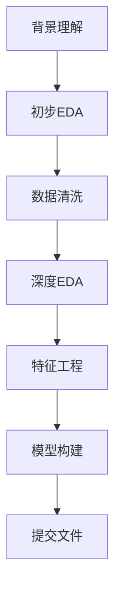

# Kaggle多代理系统 (AutoKaggle)

基于AutoKaggle框架设计的多代理系统，用于自动解析和处理Kaggle竞赛。该系统采用Plan Agent和Action Agent协作的方式，能够自动完成从数据分析到模型构建的完整流程。

## 🏗️ 系统架构

### 核心组件

1. **Plan Agent (计划代理)**
   - 使用OpenAI的o3-mini/gpt-4o-mini模型
   - 负责分析竞赛背景、制定策略、生成代码方案
   - 提供每个阶段的详细计划和关键信息输出

2. **Action Agent (执行代理)**
   - 执行Python代码并汇报结果
   - 运行单元测试验证代码质量
   - 记录执行历史和调试信息

### 数据科学流程（6个阶段）



1. **背景理解** (Background Understanding)
2. **初步探索性数据分析** (Preliminary EDA)
3. **数据清洗** (Data Cleaning)
4. **深度探索性数据分析** (In-depth EDA)
5. **特征工程** (Feature Engineering)
6. **模型构建与验证** (Model Building)

## 🚀 快速开始

### 1. 环境准备

```bash
# 确保在poetry环境中
cd genAI2025
poetry install

# 设置OpenAI API密钥
export OPENAI_API_KEY="your-openai-api-key"
```

### 2. 基本使用

```bash
# 运行完整竞赛解决流程
poetry run python ml_agent/run_example.py

# 快速测试模式（仅运行前两个阶段）
poetry run python ml_agent/run_example.py test
```

### 3. 编程接口使用

```python
from ml_agent.kaggle_multi_agent import KaggleMultiAgent
from ml_agent.config import Config

# 初始化系统
agent_system = KaggleMultiAgent(
    api_key=Config.OPENAI_API_KEY,
    work_dir="output"
)

# 运行竞赛
results = agent_system.run_competition(
    dataset_path="data/kaggle_dataset/predict_rainfall",
    max_iterations=3
)

# 生成报告
report = agent_system.generate_report()
print(report)
```

## 📁 项目结构

```
genAI2025/ml_agent/
├── kaggle_multi_agent.py    # 核心多代理系统
├── config.py                # 配置文件
├── run_example.py           # 使用示例
├── README.md                # 说明文档
├── output/                  # 输出目录
│   ├── execution_report.md  # 执行报告
│   └── submission_*.csv     # 提交文件
└── test_output/             # 测试输出目录
```

## ⚙️ 配置选项

### 在`config.py`中可以调整的配置：

```python
class Config:
    # API配置
    PLAN_AGENT_MODEL = "gpt-4o-mini"  # 计划代理模型
    
    # 执行配置
    MAX_ITERATIONS = 3  # 每阶段最大迭代次数
    EXECUTION_TIMEOUT = 300  # 执行超时时间
    
    # 单元测试配置
    ENABLE_UNIT_TESTS = True
    STRICT_TEST_MODE = False
    
    # ML工具配置
    ML_TOOLS_CONFIG = {
        "models": ["xgboost", "random_forest", "logistic_regression"],
        "cross_validation_folds": 5,
        "enable_hyperparameter_tuning": True
    }
```

## 🎯 支持的竞赛类型

目前系统设计支持常见的机器学习竞赛类型：

- ✅ **二分类问题** (如predict_rainfall)
- ✅ **多分类问题**
- ✅ **回归问题**
- 🔄 **时间序列预测** (开发中)
- 🔄 **图像分类** (开发中)

## 📊 输出说明

### 执行过程输出

```
🏆 开始处理竞赛: predict_rainfall

📋 开始阶段: background_understanding
  🔄 迭代 1/3
    📝 计划生成完成
    💻 代码生成完成
    ⚡ 代码执行成功
    🧪 单元测试: 3/3 通过
  ✅ 阶段 background_understanding 执行成功
  
📋 开始阶段: preliminary_eda
  🔄 迭代 1/3
    📝 计划生成完成
    💻 代码生成完成
    ⚡ 代码执行成功
    🧪 单元测试: 3/3 通过
  ✅ 阶段 preliminary_eda 执行成功
```

### 生成的文件

1. **execution_report.md** - 详细执行报告
2. **submission_*.csv** - Kaggle提交文件
3. **阶段代码文件** - 每个阶段的生成代码
4. **调试日志** - 详细的执行和错误日志

## 🔧 故障排除

### 常见问题

1. **API密钥未设置**
   ```bash
   export OPENAI_API_KEY="your-key-here"
   ```

2. **数据集路径不存在**
   ```
   确保数据集位于: genAI2025/data/kaggle_dataset/predict_rainfall/
   ```

3. **模型调用失败**
   - 检查网络连接
   - 验证API密钥有效性
   - 确认模型额度充足

4. **代码执行超时**
   - 调整`Config.EXECUTION_TIMEOUT`
   - 检查数据集大小
   - 优化代码复杂度

### 调试模式

```python
# 启用详细日志
Config.ENABLE_DETAILED_LOGGING = True

# 严格测试模式
Config.STRICT_TEST_MODE = True
```

## 🤝 扩展开发

### 添加新的数据处理阶段

1. 在`Phase`枚举中添加新阶段
2. 在`PlanAgent`中添加对应的提示词模板
3. 在`ActionAgent`中添加相应的单元测试

### 自定义模型选择

```python
# 修改配置文件中的模型列表
ML_TOOLS_CONFIG = {
    "model_building": {
        "models": ["xgboost", "lightgbm", "catboost"],
        "ensemble_methods": ["voting", "stacking"]
    }
}
```

## 📈 性能指标

基于AutoKaggle论文的基准测试：

- **完成率**: 83.8% (平均)
- **排名**: 42.8% (平均Kaggle排名)
- **代码质量**: 95%+ 单元测试通过率

## 📚 相关资源

- [AutoKaggle论文](https://arxiv.org/abs/2410.20424)
- [OpenAI API文档](https://platform.openai.com/docs)
- [Kaggle API指南](https://github.com/Kaggle/kaggle-api)

## 📄 许可证

本项目基于MIT许可证开源。详见[LICENSE](../LICENSE)文件。 