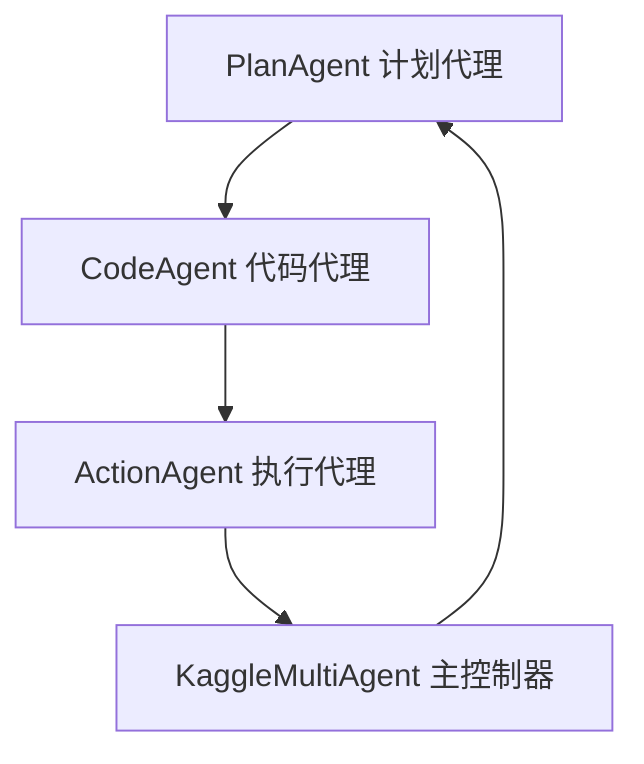

# Kaggle多代理系统 🤖

> 基于AutoKaggle框架设计的多代理系统，用于自动解析和处理Kaggle竞赛
> 适合Python初学者学习数据科学和机器学习

## 📋 项目概述

这是一个智能的多代理系统，能够自动化处理Kaggle数据科学竞赛的完整流程。系统由四个专门的AI代理协作完成从数据分析到模型构建的所有任务。

### 🌟 核心特性

- **🔄 全自动化流程** - 从数据理解到模型提交的端到端自动化
- **🤖 多代理协作** - 专业分工，各司其职的AI代理团队
- **📚 初学者友好** - 清晰的代码结构和详细的注释
- **🛠️ 智能容错** - 自动重试和代码优化机制
- **📊 详细报告** - 完整的执行过程记录和结果分析

## 🏗️ 系统架构

### 四大核心代理



| 代理 | 职责 | 功能 |
|------|------|------|
| **PlanAgent** | 策略制定 | 分析竞赛，制定各阶段详细计划 |
| **CodeAgent** | 代码生成 | 根据计划生成Python代码 |
| **ActionAgent** | 代码执行 | 执行代码并收集结果 |
| **KaggleMultiAgent** | 流程协调 | 协调各代理，管理整体流程 |

### 四个处理阶段

1. **🔍 背景理解** (`BACKGROUND_UNDERSTANDING`)
   - 解析竞赛目标和评估标准
   - 分析数据特征和挑战

2. **📊 探索性数据分析** (`EDA`)
   - 数据质量检查
   - 特征分布分析
   - 目标变量关系分析

3. **⚙️ 特征工程** (`FEATURE_ENGINEERING`)
   - 数据清洗和预处理
   - 新特征创建
   - 特征选择和缩放

4. **🎯 模型构建** (`MODEL_BUILDING`)
   - 模型训练和验证
   - 超参数调优
   - 预测结果生成

## 🚀 快速开始

### 环境要求

- Python 3.11+
- Poetry (推荐) 或 pip
- OpenAI API Key

### 安装步骤

1. **克隆项目**
```bash
git clone <repository-url>
cd genAI2025/ml_agent
```

2. **安装依赖** (使用Poetry)
```bash
poetry install
```

或使用pip:
```bash
pip install pandas numpy scikit-learn xgboost openai
```

3. **设置API密钥**
```bash
export OPENAI_API_KEY="your-openai-api-key-here"
```

4. **准备数据**
将Kaggle数据集放在 `data/kaggle_dataset/` 目录下，结构如下：
```
data/kaggle_dataset/
└── your_dataset/
    ├── desc.md              # 竞赛描述
    ├── train.csv           # 训练数据
    ├── test.csv            # 测试数据
    └── sample_submission.csv # 提交示例
```

### 运行示例

```bash
# 使用Poetry
poetry run python run_example.py

# 或直接使用Python
python run_example.py
```

## 📁 项目结构

```
ml_agent/
├── README.md                 # 项目说明文档
├── config.py                # 配置文件
├── run_example.py           # 使用示例
├── kaggle_multi_agent.py    # 核心多代理系统
└── output/                  # 输出目录
    └── dataset_name/
```

## 🔧 配置说明

在 `config.py` 中可以调整以下设置：

```python
class Config:
    # API设置
    OPENAI_API_KEY = "your-api-key"
    PLAN_AGENT_MODEL = "o3-mini"       # 计划代理模型
    CODE_AGENT_MODEL = "gpt-4o-mini"   # 代码代理模型
    
    # 执行控制
    MAX_ITERATIONS = 3          # 每阶段最大重试次数
    EXECUTION_TIMEOUT = 600     # 代码执行超时时间(秒)
    
    # 路径设置
    DEFAULT_WORK_DIR = os.getcwd()
    DEFAULT_OUTPUT_DIR = "ml_agent/output"
    DEFAULT_DATASET_PATH = "data/kaggle_dataset"
```

## 💡 使用示例

### 基本使用

```python
from kaggle_multi_agent import KaggleMultiAgent
from config import Config

# 创建多代理系统
agent_system = KaggleMultiAgent(
    api_key=Config.OPENAI_API_KEY,
    work_dir=Config.DEFAULT_WORK_DIR,
    output_dir="output/my_competition",
    timeout=Config.EXECUTION_TIMEOUT
)

# 运行竞赛
results = agent_system.run_competition(
    dataset_path="data/kaggle_dataset/predict_rainfall",
    max_iterations=3
)

# 生成报告
report = agent_system.generate_report()
print(report)
```

### 自定义数据集

1. **创建数据集目录**
```bash
mkdir -p data/kaggle_dataset/my_competition
```

2. **准备描述文件** (`desc.md`)
```markdown
# Goal
预测房价

# Evaluation
使用RMSE评估模型性能

# Submission File
提交格式：Id,SalePrice

# Metadata
DatasetSize: 1460 samples
Features: 79
```

3. **运行系统**
```python
# 在run_example.py中修改数据集名称
dataset_name = "my_competition"
```

## 📊 输出结果

系统运行后会在输出目录生成：

### 中间文件
- **计划文件** (`*_plan.md`) - 各阶段的详细计划
- **代码文件** (`*_code.py`) - 生成的Python代码
- **结果文件** (`*_result.md`) - 执行结果和输出

### 最终输出
- **执行报告** (`execution_report.md`) - 完整的执行总结
- **特征数据** (`feature_train.csv`, `feature_test.csv`) - 处理后的特征
- **提交文件** (`submission*.csv`) - 竞赛提交文件

## 🔍 代理详解

### PlanAgent (计划代理)
```python
# 主要方法
generate_phase_plan(phase, context)  # 生成阶段计划
```
**职责**: 分析竞赛要求，为每个阶段制定详细的执行计划

### CodeAgent (代码代理)
```python
# 主要方法
generate_code(phase, plan, context)     # 生成代码
review_and_refine(code, output)         # 优化代码
```
**职责**: 根据计划生成高质量的Python代码，并在失败时进行优化

### ActionAgent (执行代理)
```python
# 主要方法
execute_python_file(file_path, phase)   # 执行Python文件
```
**职责**: 执行生成的代码，收集输出结果和错误信息

### KaggleMultiAgent (主控制器)
```python
# 主要方法
run_competition(dataset_path, max_iterations)  # 运行完整流程
load_competition(dataset_path)                 # 加载竞赛数据
generate_report()                              # 生成执行报告
```
**职责**: 协调各个代理，管理整个执行流程

## 🛠️ 工具类

### FileManager (文件管理器)
```python
# 主要方法
read_text_file(file_path)           # 读取文本文件
write_text_file(file_path, content) # 写入文本文件
get_cached_content(file_path)       # 获取缓存内容
file_exists(file_path)              # 检查文件存在
```
**职责**: 统一管理所有文件操作，提供缓存机制

## ❓ 常见问题

### Q: OpenAI API调用失败怎么办？
**A**: 
1. 检查API密钥是否正确设置
2. 确认API配额是否充足
3. 检查网络连接

### Q: 代码执行超时怎么办？
**A**: 
1. 增加 `EXECUTION_TIMEOUT` 配置值
2. 检查数据集大小是否过大
3. 优化生成的代码逻辑

### Q: 如何调试生成的代码？
**A**: 
1. 查看 `output/` 目录下的代码文件
2. 手动运行生成的Python代码
3. 查看 `*_result.md` 文件中的错误信息

### Q: 如何添加新的数据科学阶段？
**A**: 
1. 在 `Phase` 枚举中添加新阶段
2. 在各代理中添加对应的处理方法
3. 更新主控制器的执行流程

### Q: 如何自定义AI模型？
**A**: 
在 `config.py` 中修改模型配置：
```python
PLAN_AGENT_MODEL = "gpt-4"      # 使用更强的模型
CODE_AGENT_MODEL = "gpt-4"      # 使用更强的模型
```

## 🤝 贡献指南

1. Fork项目
2. 创建功能分支
3. 提交更改
4. 发起Pull Request

## 📄 许可证

本项目采用MIT许可证，详见LICENSE文件。

## 🙏 致谢

- AutoKaggle框架提供的设计灵感
- OpenAI提供的强大AI模型
- 数据科学社区的宝贵经验

---

**🎯 开始你的AI数据科学之旅吧！** 

如有问题，请查看[常见问题](#-常见问题)或提交Issue。